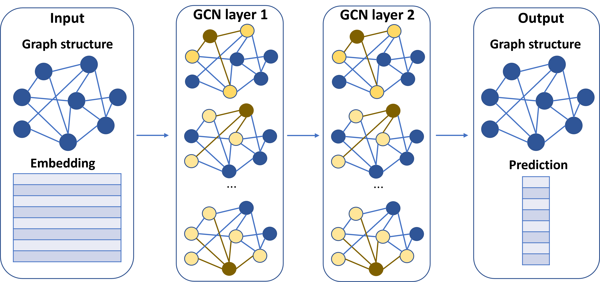
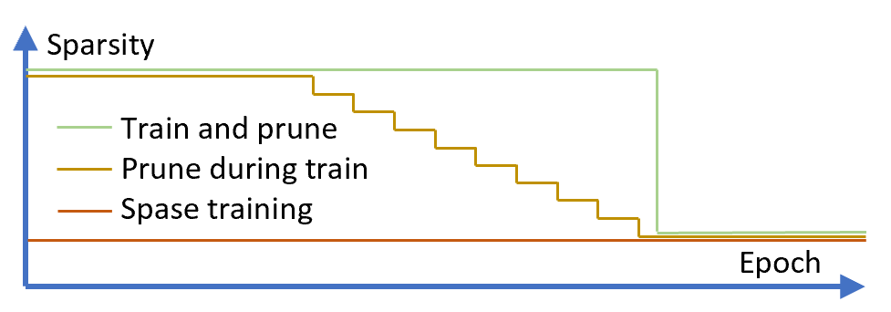

## Towards Sparsification of Graph Neural Networks

Comparison between SLR method and sparse training method on GNN dataset. 

  
   
   
  

  
   
   
  

##### Train and prune: 
we use the SLR method for train and prune.

###### 1. Link prediction & SLR

Folder `SLR_Link_Pred` is for SLR training for link prediction, which follows dense training -> reweight training -> sparse training procedure. 

###### 2. Node classification & SLR

Folder `SLR_Node_Class` is for SLR training for node classification, which follows dense training -> reweight training -> sparse training procedure. 

###### 3. Graph Convolution Networks for Node classification datasets & SLR

Folder `SLR_GCN_Node_Class` is for SLR training for node classification, which follows dense training -> reweight training -> sparse training procedure. The training and prune experiment is done on 3 dataset: Cora, Pubmed, and CiteSeer

##### Sparse training: 
we follow same experiment setup as RigL paper (rigging the lottery: making all tickets winners), using weight magnitute for drop and weight gradient for grow. 

